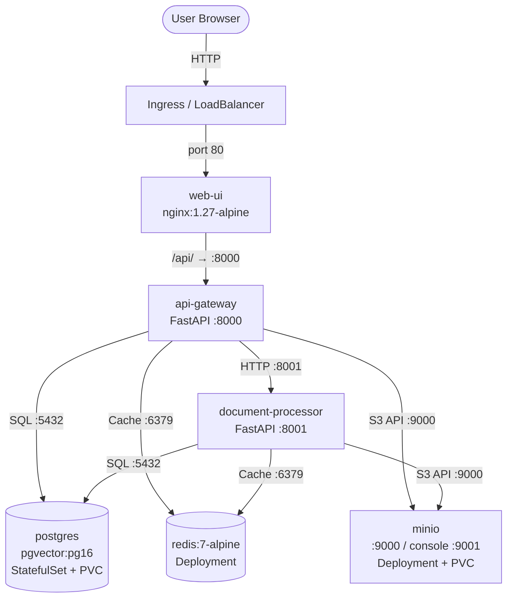

# YellowPad AI — Kubernetes Solution

## Overview

This document describes the Kubernetes deployment of the YellowPad AI application. The manifests in the `k8s/` directory translate the original Docker Compose setup into production-ready Kubernetes resources, preserving all service dependencies, health checks, and configuration patterns from the original compose file.

Each Docker Compose service becomes one or more Kubernetes resources (Deployment or StatefulSet, Service, and supporting objects). Sensitive configuration is moved into Secrets, and non-sensitive configuration is centralized in a ConfigMap.

---

## Architecture



---

## Components

| Component | Kind | Image | Port | Storage | Notes |
|---|---|---|---|---|---|
| postgres | StatefulSet | pgvector/pgvector:pg16 | 5432 | 10Gi PVC | pgvector extension for embeddings |
| redis | Deployment | redis:7-alpine | 6379 | - | Cache layer |
| minio | Deployment | minio/minio:latest | 9000/9001 | 20Gi PVC | S3-compatible object store |
| api-gateway | Deployment | yellowpad/api-gateway:latest | 8000 | - | Main API, coordinates all services |
| document-processor | Deployment | yellowpad/document-processor:latest | 8001 | - | Background document processing worker |
| web-ui | Deployment | yellowpad/web-ui:latest | 80 | - | nginx, proxies /api/ to api-gateway |

---

## Manifest Structure

| File | Description |
|---|---|
| `00-namespace.yaml` | Creates the `yellowpad` namespace that all other resources live in |
| `01-secrets.yaml` | Database and MinIO credentials stored as Kubernetes Secrets |
| `02-configmap.yaml` | Non-sensitive application configuration (hostnames, ports, bucket name) |
| `03-postgres.yaml` | Headless Service + StatefulSet for PostgreSQL with pgvector, 10Gi PVC |
| `04-redis.yaml` | ClusterIP Service + Deployment for Redis cache |
| `05-minio.yaml` | PVC + ClusterIP Service + Deployment for MinIO object storage |
| `06-api-gateway.yaml` | ClusterIP Service + Deployment for the FastAPI api-gateway |
| `07-document-processor.yaml` | ClusterIP Service + Deployment for the document processing worker |
| `08-web-ui.yaml` | LoadBalancer Service + Deployment for the nginx web frontend |
| `09-ingress.yaml` | Cilium Ingress rule routing `yellowpad.local` traffic to the web-ui |
| `10-network-policies.yaml` | Default-deny + per-service allow rules enforced by Cilium |
| `11-cilium-lb-ippool.yaml` | CiliumLoadBalancerIPPool — assigns local IPs to the Ingress service (no cloud provider) |

---

## Key Design Decisions

### Why postgres uses StatefulSet

PostgreSQL is deployed as a StatefulSet rather than a Deployment. StatefulSets provide a stable, predictable network identity (`postgres-0`) and guarantee ordered startup and termination. Critically, they support `volumeClaimTemplates`, which automatically provisions a dedicated PVC per replica. This ensures that even if the pod is rescheduled, it reattaches to the same persistent volume and its data is never lost.

### Secret management

Sensitive values (database password, MinIO credentials) are stored in Kubernetes Secrets (`yellowpad-db-secret`, `yellowpad-minio-secret`) and injected into pods as environment variables via `secretKeyRef`. Non-sensitive configuration (hostnames, ports, bucket names) is stored in a single ConfigMap (`yellowpad-config`) and injected via `envFrom`. This separation ensures secrets are not exposed in ConfigMaps and can be managed with different RBAC policies.

### Health probe strategy

The api-gateway exposes two distinct health endpoints with different semantics:

- `GET /healthz` — returns `200` only when all downstream dependencies (postgres, redis, minio) are reachable; returns `503` if any dependency is down.
- `GET /` — always returns `200` regardless of dependency state.

Because of this, `/healthz` is used exclusively for the **readinessProbe**. Kubernetes will stop routing traffic to a pod that fails readiness, correctly shedding load when dependencies are unavailable. The **livenessProbe** uses `/` instead — using `/healthz` for liveness would cause Kubernetes to restart a healthy api-gateway pod simply because a downstream dependency (e.g., postgres) is temporarily unavailable, which would be counterproductive.

The document-processor's `/healthz` always returns `{"status":"ok"}`, so it is safe to use for both readiness and liveness probes.

### Service naming

The web-ui nginx configuration proxies requests with the `/api/` prefix to `http://api-gateway:8000/`. Kubernetes DNS resolves service names within the same namespace, so the Service for the api-gateway **must** be named exactly `api-gateway`. This name is hardcoded in the nginx.conf inside the web-ui image and cannot be changed without rebuilding the image.

### Docker Compose `depends_on` → Kubernetes readiness probes

Docker Compose `depends_on` with health checks holds a service from starting until its dependencies report healthy. Kubernetes does not have an equivalent startup ordering mechanism across Deployments. Instead, the application services (api-gateway, document-processor) are expected to handle transient connection failures gracefully (retry logic, backoff). Kubernetes readiness probes ensure that a pod only receives traffic once it is itself ready, and liveness probes restart pods that become permanently stuck. This is the idiomatic Kubernetes approach to dependency management.

---

## Cilium CNI

This deployment uses [Cilium](https://cilium.io/) as the sole CNI — no separate nginx Ingress controller is needed.

### What Cilium replaces

| Concern | Without Cilium | With Cilium |
|---|---|---|
| Ingress | nginx Ingress controller | Cilium's built-in Envoy-based Ingress |
| Network policies | Calico / weave | Standard K8s NetworkPolicy (enforced by Cilium) |
| L7 policies | Not available | CiliumNetworkPolicy CRDs (HTTP, gRPC, DNS) |
| Load balancing | Cloud ALB / MetalLB | Cilium LB IPAM — assigns local IPs without a cloud provider |

### Local cluster — no cloud load balancer needed

The `web-ui` Service is `ClusterIP`. External traffic enters only through the Cilium Ingress, which Cilium exposes via its own `LoadBalancer` service. On a local cluster, **Cilium LB IPAM** (`11-cilium-lb-ippool.yaml`) assigns a real IP from your local network to that service — no cloud provider, no MetalLB required.

Update the CIDR in `11-cilium-lb-ippool.yaml` to a free range on your node's network before applying.

### Enable Cilium Ingress controller + LB IPAM

```bash
helm install cilium cilium/cilium \
  --namespace kube-system \
  --set ingressController.enabled=true \
  --set ingressController.default=true \
  --set ingressController.loadbalancerMode=shared \
  --set loadBalancer.l2.enabled=true \
  --set loadBalancer.l2.interfaces[0]=eth0   # replace with your node's interface
```

The `09-ingress.yaml` uses `ingressClassName: cilium`. Cilium creates an Envoy proxy in `kube-system`; the `CiliumLoadBalancerIPPool` assigns it a local IP — no nginx, no cloud ALB needed.

### Traffic flow on a local cluster

```
Browser → yellowpad.local  (via /etc/hosts → LB IPAM-assigned IP)
         → Cilium Ingress service  (LoadBalancer, IP from CiliumLoadBalancerIPPool)
         → Cilium Envoy proxy  (pod in kube-system)
         → web-ui Service  (ClusterIP :80)
         → web-ui pod (nginx) → proxies /api/ → api-gateway Service (:8000)
                                              → api-gateway pod
```

### Network policies (`10-network-policies.yaml`)

Cilium enforces standard `networking.k8s.io/v1` NetworkPolicy natively. The manifest applies a **default-deny-ingress** policy for the entire namespace, then adds explicit allow rules:

```
web-ui         ──:80──►  [internet via Ingress]
api-gateway    ◄─:8000─  web-ui
api-gateway    ──:5432─► postgres
api-gateway    ──:6379─► redis
api-gateway    ──:9000─► minio
api-gateway    ──:8001─► document-processor
document-proc  ──:5432─► postgres
document-proc  ──:6379─► redis
document-proc  ──:9000─► minio
```

For L7 policies (e.g. allow only `POST /documents` from web-ui), upgrade to `CiliumNetworkPolicy` CRDs — the standard policies here are a drop-in replacement that can be enhanced later.

---

## How to Deploy

```bash
# 1. Install Cilium with Ingress controller + LB IPAM enabled
helm repo add cilium https://helm.cilium.io/
helm install cilium cilium/cilium \
  --namespace kube-system \
  --set ingressController.enabled=true \
  --set ingressController.default=true \
  --set ingressController.loadbalancerMode=shared \
  --set loadBalancer.l2.enabled=true \
  --set loadBalancer.l2.interfaces[0]=eth0   # replace with your node's NIC

# 1b. Edit 11-cilium-lb-ippool.yaml — set CIDR to a free range on your local network
#     e.g. if nodes are on 192.168.1.0/24, use 192.168.1.200/29

# 2. Build and push images
docker build -t yellowpad/api-gateway:latest ./src/api-gateway
docker build -t yellowpad/document-processor:latest ./src/document-processor
docker build -t yellowpad/web-ui:latest ./src/web-ui
# Push to your registry, update image refs in manifests if needed

# 3. Apply all manifests in order
kubectl apply -f k8s/

# 4. Wait for pods to be ready
kubectl -n yellowpad get pods -w

# 5. Find the IP assigned to the Cilium Ingress service by LB IPAM
kubectl -n kube-system get svc cilium-ingress-yellowpad-yellowpad-ingress
# Add to /etc/hosts: echo "<ASSIGNED_IP> yellowpad.local" >> /etc/hosts
# Then open: http://yellowpad.local
```

---

## Secrets Note

> **Warning: Development credentials only.**

The secrets in `01-secrets.yaml` use `stringData` with default plaintext credentials (`yellowpad`, `minioadmin`). This is acceptable for local development and testing only.

In production environments:

- Use an external secrets manager such as **HashiCorp Vault**, **AWS Secrets Manager**, or **Azure Key Vault**, integrated into Kubernetes via the Secrets Store CSI Driver or an operator.
- Alternatively, use **Bitnami Sealed Secrets** to encrypt secret manifests so they can be safely committed to version control.
- At a minimum, replace `stringData` with `data` containing base64-encoded values, and inject secrets via a CI/CD pipeline rather than committing them to the repository.
- Rotate all default credentials before any production deployment.
